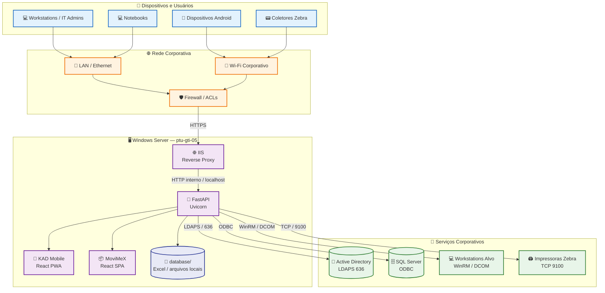
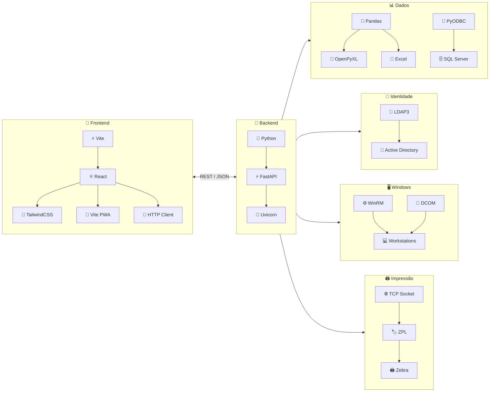
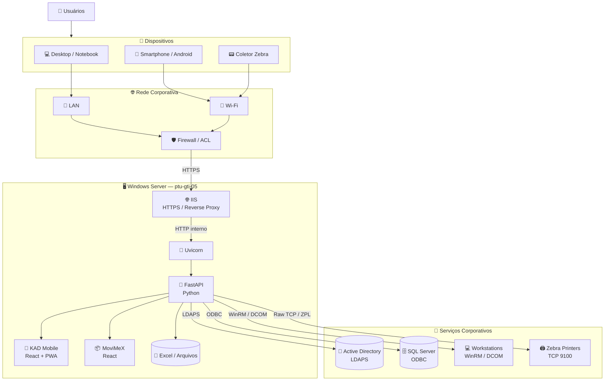

# 🏢 KAD Mobile & MoviMeX — Enterprise Management Hub

> **Plataforma corporativa unificada para gestão de TI, Active Directory, suporte remoto, inventário e impressão industrial.**

O **KAD Mobile & MoviMeX** é uma plataforma web corporativa desenvolvida para centralizar operações de **Tecnologia da Informação**, **suporte técnico**, **gestão de usuários do Active Directory**, **inventário de materiais** e **impressão de etiquetas industriais**.

A solução utiliza uma arquitetura composta por uma **API central em Python/FastAPI**, responsável por hospedar e integrar duas aplicações frontend independentes desenvolvidas em React:

* 🔐 **KAD Mobile** — PWA para administração do Active Directory, suporte técnico, auditoria e operações remotas.
* 📦 **MoviMeX** — aplicação de inventário e logística para coletores Android e impressão de etiquetas ZPL em impressoras Zebra.

A aplicação foi projetada para operar dentro de uma **rede corporativa**, integrando serviços Windows, Active Directory, SQL Server, estações de trabalho, coletores móveis e impressoras industriais.

---

## 📑 Sumário

* [Visão geral](#-visão-geral)
* [Principais módulos](#-principais-módulos)
* [Arquitetura da solução](#-arquitetura-da-solução)
* [Diagrama de infraestrutura e rede](#-diagrama-de-infraestrutura-e-rede)
* [Fluxo da infraestrutura](#-fluxo-da-infraestrutura)
* [Diagrama das tecnologias](#-diagrama-das-tecnologias)
* [Stack tecnológica](#-stack-tecnológica)
* [KAD Mobile](#-kad-mobile)
* [MoviMeX](#-movimex)
* [Integrações](#-integrações)
* [Fluxos principais](#-fluxos-principais)
* [Estrutura do projeto](#-estrutura-do-projeto)
* [Arquitetura do backend](#-arquitetura-do-backend)
* [Arquitetura dos frontends](#-arquitetura-dos-frontends)
* [API](#-api)
* [Banco e fontes de dados](#-banco-e-fontes-de-dados)
* [Segurança](#-segurança)
* [Auditoria e logs](#-auditoria-e-logs)
* [Tratamento de falhas](#-tratamento-de-falhas)
* [Instalação](#-instalação)
* [Build dos frontends](#-build-dos-frontends)
* [Execução](#-execução)
* [Deploy em produção](#-deploy-em-produção)
* [Configuração de rede](#-configuração-de-rede)
* [Monitoramento](#-monitoramento)
* [Boas práticas](#-boas-práticas)
* [Troubleshooting](#-troubleshooting)
* [Roadmap](#-roadmap)
* [Licença](#-licença)

---

# 📌 Visão geral

O sistema segue um modelo de **hub corporativo**, no qual os dispositivos e usuários não acessam diretamente cada serviço interno.

O fluxo principal é:

```text
┌───────────────────────┐
│ Usuário / Dispositivo │
│                       │
│ • Desktop             │
│ • Notebook            │
│ • Android             │
│ • Coletor Zebra       │
└───────────┬───────────┘
            │
            │ HTTPS
            ▼
┌───────────────────────┐
│    IIS / Reverse      │
│       Proxy           │
└───────────┬───────────┘
            │
            │ HTTP interno
            ▼
┌───────────────────────┐
│   FastAPI / Uvicorn   │
│                       │
│  API + Frontends      │
└───────────┬───────────┘
            │
     ┌──────┼───────────────┐
     ▼      ▼               ▼
    AD   SQL Server      Arquivos
                           locais
```

A API funciona como o **ponto central de integração** entre os clientes e os serviços corporativos.

---

# 🧩 Principais módulos

## 🔐 KAD Mobile

Console web/PWA voltado para operações de infraestrutura e suporte de TI.

Principais recursos:

* Gestão de usuários do Active Directory.
* Reset de senha.
* Desbloqueio de contas.
* Consulta de informações de usuários.
* Gestão de grupos.
* Movimentação entre OUs.
* Consultas administrativas.
* Diagnósticos de estações.
* Execução remota de operações administrativas.
* Gerenciamento de WinRM.
* Auditoria das operações realizadas.
* Integração com informações provenientes do ambiente corporativo.
* Operações relacionadas a mecanismos corporativos de recuperação e gerenciamento de credenciais, respeitando as políticas de segurança da organização.

---

## 📦 MoviMeX

Sistema voltado para operações de inventário e logística.

Principais recursos:

* Leitura de códigos através de coletores Android.
* Tratamento e normalização de códigos.
* Consulta de informações de materiais.
* Processamento de arquivos de inventário.
* Integração com dados provenientes do SAP/KBM.
* Geração dinâmica de etiquetas.
* Impressão ZPL.
* Comunicação direta com impressoras Zebra.
* Operação através de dispositivos móveis conectados à rede corporativa.

---

# 🏗️ Arquitetura da solução

A arquitetura pode ser dividida em cinco camadas:

```text
┌────────────────────────────────────────────────────────────┐
│                    CAMADA DE CLIENTES                      │
│                                                            │
│  💻 Desktops    💻 Notebooks    📱 Android    📟 Zebra   │
└──────────────────────────┬─────────────────────────────────┘
                           │
                           │ HTTPS
                           ▼
┌────────────────────────────────────────────────────────────┐
│                    CAMADA DE ACESSO                        │
│                                                            │
│                 IIS / Reverse Proxy                        │
└──────────────────────────┬─────────────────────────────────┘
                           │
                           ▼
┌────────────────────────────────────────────────────────────┐
│                   CAMADA DE APLICAÇÃO                      │
│                                                            │
│                     FastAPI / Uvicorn                      │
│                                                            │
│       ┌────────────────┐      ┌────────────────┐           │
│       │   KAD Mobile   │      │    MoviMeX     │           │
│       │      PWA       │      │      SPA       │           │
│       └────────────────┘      └────────────────┘           │
└──────────────────────────┬─────────────────────────────────┘
                           │
              ┌────────────┼─────────────┐
              │            │             │
              ▼            ▼             ▼
┌──────────────────┐ ┌──────────────┐ ┌────────────────────┐
│ Active Directory │ │ SQL Server   │ │ Arquivos locais    │
│      LDAPS       │ │    ODBC      │ │ Excel / relatórios │
└──────────────────┘ └──────────────┘ └────────────────────┘
              │
              │
       ┌──────┴──────────┐
       ▼                 ▼
┌──────────────┐  ┌───────────────┐
│ Workstations │  │ Impressoras   │
│ WinRM/DCOM   │  │ Zebra / ZPL   │
└──────────────┘  └───────────────┘
```

---

# 🌐 Diagrama de infraestrutura e rede

O diagrama abaixo representa a infraestrutura física/lógica da aplicação.



## 🔎 Explicação do diagrama

### 1. Dispositivos clientes

Os usuários acessam o sistema utilizando:

* Computadores da equipe de TI.
* Notebooks.
* Coletores Android.
* Coletores Zebra compatíveis.
* Outros dispositivos móveis com navegador compatível.

Os dispositivos móveis utilizam a rede Wi-Fi corporativa, enquanto as estações de trabalho normalmente utilizam a LAN.

---

### 2. Rede corporativa

A comunicação entre os clientes e o sistema ocorre através da infraestrutura de rede corporativa.

O acesso recomendado é:

```text
Cliente
   │
   │ HTTPS
   ▼
Rede Corporativa
   │
   ▼
Firewall / ACL
   │
   ▼
IIS
```

O ideal é que o servidor de aplicação **não fique diretamente exposto à Internet**.

---

### 3. IIS

O IIS funciona como **Reverse Proxy**.

Ele recebe as requisições externas e encaminha internamente para o processo FastAPI/Uvicorn.

Isso permite separar:

```text
Internet / Rede Corporativa
          │
          ▼
         IIS
          │
          ▼
     FastAPI/Uvicorn
```

Entre outras vantagens:

* Centralização do acesso HTTP/HTTPS.
* Gerenciamento de certificados TLS.
* Controle de portas externas.
* Integração com infraestrutura Windows.
* Possibilidade de regras de URL.
* Separação entre acesso externo e serviço interno.

---

### 4. FastAPI

O FastAPI representa o núcleo da aplicação.

É responsável por:

* APIs REST.
* Autenticação/autorização.
* Integrações corporativas.
* Processamento dos dados.
* Comunicação com Active Directory.
* Comunicação com SQL Server.
* Operações remotas.
* Processamento dos arquivos.
* Comunicação com impressoras.
* Disponibilização dos frontends.

---

# 🔄 Fluxo geral de comunicação

```text
                    ┌─────────────────┐
                    │     Usuário     │
                    └────────┬────────┘
                             │
                             ▼
                    ┌─────────────────┐
                    │ Navegador / PWA │
                    └────────┬────────┘
                             │
                           HTTPS
                             │
                             ▼
                    ┌─────────────────┐
                    │      IIS        │
                    │ Reverse Proxy   │
                    └────────┬────────┘
                             │
                       HTTP interno
                             │
                             ▼
                    ┌─────────────────┐
                    │    FastAPI      │
                    │     Backend     │
                    └────────┬────────┘
                             │
          ┌──────────────────┼───────────────────┐
          │                  │                   │
          ▼                  ▼                   ▼
     Active Directory    SQL Server         Arquivos
          │                  │                   │
          └──────────────────┼───────────────────┘
                             │
                             ▼
                     Serviços finais
                             │
              ┌──────────────┴─────────────┐
              ▼                            ▼
        Workstations                 Impressoras
```

---

# 🧱 Diagrama das tecnologias

Este diagrama representa como as tecnologias se relacionam dentro do sistema.



---

# 🛠️ Stack tecnológica

| Camada         | Tecnologia     | Função                            |
| -------------- | -------------- | --------------------------------- |
| Frontend       | React          | Interfaces web                    |
| Build          | Vite           | Compilação e desenvolvimento      |
| UI             | TailwindCSS    | Estilização                       |
| PWA            | Vite PWA       | Aplicação instalável/cache        |
| Backend        | Python         | Linguagem principal               |
| API            | FastAPI        | API REST                          |
| ASGI           | Uvicorn        | Servidor da aplicação             |
| AD             | LDAP3          | Comunicação LDAP/LDAPS            |
| Dados          | Pandas         | Processamento de dados            |
| Excel          | OpenPyXL       | Manipulação de planilhas          |
| SQL            | PyODBC         | Comunicação com SQL Server        |
| Proxy          | IIS            | Reverse Proxy                     |
| Remoto         | WinRM          | Administração remota Windows      |
| Remoto         | DCOM           | Operações administrativas Windows |
| Impressão      | Raw TCP Socket | Comunicação com impressoras       |
| Impressão      | ZPL            | Linguagem de etiquetas Zebra      |
| Mobile         | Android/PWA    | Operação em dispositivos móveis   |
| Infraestrutura | Windows Server | Hospedagem                        |

---

# 🔐 KAD Mobile

O KAD Mobile é a interface destinada principalmente à equipe de TI e administradores autorizados.

## Funcionalidades

### 👤 Active Directory

Permite centralizar operações administrativas como:

* Consulta de usuários.
* Reset de senha.
* Desbloqueio de contas.
* Consulta de grupos.
* Gestão de grupos.
* Movimentação de usuários entre OUs.
* Consulta de atributos.
* Operações administrativas autorizadas.

O backend utiliza **LDAP/LDAPS** para comunicação com o Active Directory.

```text
KAD Mobile
     │
     │ REST / JSON
     ▼
 FastAPI
     │
     │ LDAP/LDAPS
     ▼
Active Directory
```

---

## ⚡ Administração remota

O KAD Mobile possui integração com mecanismos de administração remota Windows.

A arquitetura conceitual é:

```text
Administrador
     │
     ▼
KAD Mobile
     │
     ▼
FastAPI
     │
     ├──────────────► WinRM
     │
     └──────────────► DCOM
                         │
                         ▼
                  Workstation alvo
```

Isso possibilita centralizar operações de suporte e diagnóstico sem exigir que o administrador esteja fisicamente na estação.

> ⚠️ Operações remotas devem ser limitadas a administradores autorizados, registradas em auditoria e protegidas por políticas de acesso adequadas.

---

# 📦 MoviMeX

O MoviMeX foi desenvolvido para operações de inventário e logística.

Seu principal cenário de utilização envolve:

```text
📟 Coletor Android
       │
       │ Wi-Fi
       ▼
   MoviMeX PWA
       │
       │ HTTPS
       ▼
    FastAPI
       │
       ├──────► Arquivos / relatórios
       │
       └──────► Impressora Zebra
                       │
                       │ TCP 9100
                       ▼
                  🖨️ Etiqueta
```

---

## 📱 Leitura de códigos

Os dados recebidos dos coletores podem passar por uma etapa de normalização antes de serem utilizados.

Exemplo conceitual:

```text
Entrada do coletor
        │
        ▼
Normalização
        │
        ▼
Regex / limpeza
        │
        ▼
Código padronizado
        │
        ▼
Consulta / processamento
```

Essa etapa permite lidar com códigos que chegam com formatação adicional ou representação numérica proveniente do dispositivo ou da fonte de dados.

---

# 🖨️ Impressão Zebra

O sistema utiliza comunicação direta através de **Raw Socket TCP**, normalmente na porta:

```text
TCP/9100
```

O fluxo é:

```text
MoviMeX
   │
   ▼
FastAPI
   │
   │ TCP Socket
   ▼
IP da impressora
   │
   │ Porta 9100
   ▼
Zebra
   │
   ▼
Etiqueta física
```

A aplicação gera o conteúdo em **ZPL (Zebra Programming Language)**.

Exemplo conceitual:

```text
┌─────────────────────────────┐
│       ETIQUETA MOVIMEX      │
│                             │
│ Material: 123456            │
│ Descrição: PRODUTO XYZ      │
│                             │
│ |||||||||||||||||||||||     │
│ || Código de barras |||     │
│ |||||||||||||||||||||||     │
└─────────────────────────────┘
```

---

# 📊 Integração com dados

O sistema trabalha com diferentes fontes de dados.

## Excel

Utilizado principalmente para dados locais e relatórios operacionais.

Tecnologias:

* Pandas.
* OpenPyXL.

Fluxo:

```text
Excel
  │
  ▼
OpenPyXL / Pandas
  │
  ▼
FastAPI
  │
  ▼
Frontend
```

---

## SQL Server

A integração com SQL Server é realizada utilizando:

```text
Python
   │
   ▼
PyODBC
   │
   ▼
ODBC Driver
   │
   ▼
SQL Server
```

Essa integração é utilizada para informações corporativas relacionadas ao ambiente de negócio, incluindo integrações com o sistema Vetorh.

---

# 🔐 Active Directory

A comunicação com o Active Directory utiliza LDAP/LDAPS.

Arquitetura:

```text
FastAPI
   │
   ▼
LDAP3
   │
   ▼
LDAPS
   │
   │ TCP 636
   ▼
Active Directory
```

O uso de **LDAPS** permite que as operações de diretório sejam realizadas através de uma conexão protegida.

---

# 🏗️ Estrutura do projeto

A estrutura esperada para o servidor é semelhante a:

```text
C:\KAD-Movimex
│
├── main.py
├── requirements.txt
├── README.md
│
├── venv/
│
├── database/
│   ├── KBM72_-_Bar_Code_by_Invoice.xlsx
│   └── printer-config.xlsx
│
├── kad-pwa/
│   ├── package.json
│   ├── vite.config.js
│   ├── src/
│   └── dist/
│
└── movimex-dist/
    ├── index.html
    ├── assets/
    └── ...
```

---

# 🧠 Arquitetura do Backend

O backend pode ser entendido como o seguinte conjunto de responsabilidades:

```text
                    ┌──────────────────┐
                    │     FastAPI      │
                    └────────┬─────────┘
                             │
        ┌────────────────────┼─────────────────────┐
        │                    │                     │
        ▼                    ▼                     ▼
┌───────────────┐    ┌───────────────┐     ┌───────────────┐
│ Active        │    │ Dados         │     │ Administração │
│ Directory     │    │ Corporativos  │     │ Remota        │
│               │    │               │     │               │
│ LDAP3         │    │ Pandas        │     │ WinRM         │
│ LDAPS         │    │ OpenPyXL      │     │ DCOM          │
└───────────────┘    │ PyODBC        │     └───────────────┘
                     └───────────────┘
                             │
                             ▼
                    ┌─────────────────┐
                    │    MoviMeX      │
                    │   Impressão     │
                    │   ZPL / TCP     │
                    └─────────────────┘
```

Uma divisão recomendada para evolução futura é:

```text
backend/
├── main.py
├── api/
│   ├── routes/
│   └── dependencies/
├── services/
│   ├── active_directory/
│   ├── sqlserver/
│   ├── inventory/
│   ├── printer/
│   └── remote/
├── models/
├── schemas/
├── utils/
└── logging/
```

Essa organização reduz o acoplamento e facilita testes e manutenção.

---

# 🎨 Arquitetura dos Frontends

Existem duas interfaces independentes.

```text
                    ┌──────────────────┐
                    │     FastAPI      │
                    └────────┬─────────┘
                             │
              ┌──────────────┴──────────────┐
              │                             │
              ▼                             ▼
       ┌───────────────┐             ┌───────────────┐
       │   KAD Mobile  │             │    MoviMeX    │
       │               │             │               │
       │ React         │             │ React         │
       │ Vite          │             │ Vite          │
       │ Tailwind      │             │ Tailwind      │
       │ PWA           │             │ SPA/PWA       │
       └───────────────┘             └───────────────┘
```

---

# 🌐 Rotas das aplicações

A arquitetura prevê uma separação lógica entre as interfaces.

Exemplo:

```text
/
├── KAD Mobile
│
├── /api
│   └── Endpoints REST
│
└── /Movimex
    └── MoviMeX
```

O `base` do Vite do MoviMeX deve ser configurado para:

```javascript
base: '/Movimex/'
```

Isso garante que os assets e as rotas da aplicação sejam resolvidos corretamente quando o frontend estiver hospedado dentro da aplicação principal.

---

# 🔗 API

A comunicação entre frontend e backend ocorre através de:

```text
Frontend
   │
   │ HTTPS
   │
   │ REST / JSON
   ▼
FastAPI
```

Exemplo conceitual:

```http
GET /api/usuario/{id}
```

Resposta:

```json
{
  "status": "success",
  "data": {
    "usuario": "usuario.exemplo",
    "nome": "Usuário Exemplo"
  }
}
```

> Os endpoints reais devem ser documentados conforme a implementação atual do `main.py`.

O FastAPI também permite disponibilizar documentação interativa da API através das interfaces de documentação quando habilitadas no ambiente.

---

# 📁 Banco e fontes de dados

Apesar do sistema utilizar SQL Server para determinadas integrações, parte das informações operacionais trabalha com arquivos locais.

## Diretório `database/`

```text
database/
│
├── KBM72_-_Bar_Code_by_Invoice.xlsx
│
└── printer-config.xlsx
```

### KBM

Utilizado como fonte para informações relacionadas ao inventário e códigos.

### Printer Config

Pode centralizar informações necessárias para localização/configuração das impressoras.

> Arquivos que contenham informações sensíveis ou específicas do ambiente corporativo não devem ser versionados publicamente no GitHub.

---

# 🔒 Segurança

Por lidar com infraestrutura corporativa, Active Directory, estações de trabalho e informações administrativas, segurança deve ser considerada parte fundamental da arquitetura.

## Princípios recomendados

### 🔐 Autenticação

O acesso deve ser restrito a usuários autorizados.

Sempre que possível:

* Utilizar autenticação corporativa.
* Implementar controle baseado em função.
* Aplicar princípio do menor privilégio.
* Evitar credenciais fixas no código.

---

## 🔑 Segredos

Nunca armazenar no Git:

```text
❌ Senhas
❌ Tokens
❌ Chaves privadas
❌ Credenciais LDAP
❌ Credenciais SQL
❌ Credenciais administrativas
❌ Secrets de produção
```

Utilizar variáveis de ambiente ou um mecanismo corporativo de gerenciamento de segredos.

Exemplo:

```env
AD_SERVER=ldaps://dc.exemplo.local
AD_BASE_DN=DC=exemplo,DC=local

SQL_SERVER=sqlserver.exemplo.local
SQL_DATABASE=database

APP_ENV=production
```

O arquivo `.env` deve estar no `.gitignore`.

---

# 🛡️ Controle de acesso

Recomenda-se separar as operações por níveis de privilégio.

Exemplo conceitual:

```text
┌─────────────────────────────┐
│         Usuário             │
└──────────────┬──────────────┘
               │
               ▼
        ┌──────────────┐
        │ Autorização  │
        └──────┬───────┘
               │
       ┌───────┼────────┐
       ▼       ▼        ▼
     Leitura  Suporte  Admin
       │       │        │
       ▼       ▼        ▼
      API     API      API
```

Operações críticas devem possuir autorização adicional quando necessário.

---

# 📝 Auditoria e logs

As operações administrativas devem possuir rastreabilidade.

Um evento de auditoria pode conter:

```json
{
  "timestamp": "2026-08-12T13:00:00",
  "usuario": "admin",
  "acao": "operacao_administrativa",
  "alvo": "usuario-ou-estacao",
  "resultado": "success"
}
```

Dependendo da política da empresa, os logs podem registrar:

* Data/hora.
* Usuário responsável.
* Operação executada.
* Alvo da operação.
* Resultado.
* Erros.
* Identificador da requisição.

**Não registrar senhas, tokens ou outros segredos nos logs.**

---

# ⚠️ Operações sensíveis

O KAD Mobile possui funcionalidades que podem acessar informações altamente privilegiadas do ambiente Windows.

Essas funções devem:

* Ser protegidas por autenticação forte.
* Ser restritas a administradores autorizados.
* Possuir auditoria.
* Evitar exposição desnecessária de credenciais.
* Seguir as políticas internas de segurança.
* Ter acesso limitado à equipe responsável pela infraestrutura.

Informações como credenciais administrativas, segredos de recuperação e dados equivalentes não devem ser expostos diretamente no frontend ou armazenados em arquivos públicos do projeto.

---

# 🧯 Tratamento de falhas

A aplicação possui tratamento de exceções para evitar que falhas individuais provoquem a indisponibilidade completa do servidor.

Fluxo recomendado:

```text
Request
   │
   ▼
FastAPI
   │
   ▼
Serviço
   │
   ├──────► Sucesso
   │          │
   │          ▼
   │        Response
   │
   └──────► Exceção
              │
              ▼
         Exception Handler
              │
              ▼
          Log do erro
              │
              ▼
       HTTP Error Response
```

---

## 📊 Erros de arquivos

Operações com Excel devem possuir tratamento de:

* Arquivo inexistente.
* Arquivo bloqueado.
* Arquivo corrompido.
* Estrutura inesperada.
* Colunas ausentes.
* Permissões insuficientes.
* Alterações no formato do relatório.

O erro deve ser registrado no backend sem derrubar o processo principal.

---

# 📱 PWA e Service Worker

O KAD Mobile utiliza PWA.

O Service Worker deve ser configurado com cuidado para evitar interferência nas rotas do backend e do MoviMeX.

Principalmente:

```text
/api/*
```

e

```text
/Movimex/*
```

não devem ser indevidamente interceptados pelo cache do frontend.

A separação lógica deve seguir:

```text
                 Navegador
                     │
          ┌──────────┴──────────┐
          │                     │
          ▼                     ▼
     /api/*                 /Movimex/*
          │                     │
          ▼                     ▼
       FastAPI               MoviMeX
```

---

# 🚀 Instalação

## Pré-requisitos

Servidor Windows com:

* Python 3.9 ou superior.
* Node.js.
* npm.
* IIS.
* ODBC Driver for SQL Server.
* Acesso à rede corporativa.
* Permissões necessárias no Active Directory.
* Conectividade com SQL Server.
* Conectividade com estações de trabalho quando operações remotas forem utilizadas.
* Conectividade com impressoras Zebra.

---

# 🐍 Instalação do Backend

Clone o projeto:

```bash
git clone <URL_DO_REPOSITORIO>
cd KAD-Movimex
```

Crie o ambiente virtual:

```bash
python -m venv venv
```

Ative:

```powershell
.\venv\Scripts\activate
```

Instale as dependências:

```bash
pip install -r requirements.txt
```

Caso o `requirements.txt` ainda não exista, as principais dependências são:

```text
fastapi
uvicorn
pandas
openpyxl
pyodbc
ldap3
python-jose
```

---

# 📦 `requirements.txt`

Exemplo:

```text
fastapi
uvicorn[standard]
pandas
openpyxl
pyodbc
ldap3
python-jose
```

Para produção, recomenda-se fixar versões após validar o ambiente:

```text
fastapi==<versão-validada>
uvicorn[standard]==<versão-validada>
pandas==<versão-validada>
openpyxl==<versão-validada>
pyodbc==<versão-validada>
ldap3==<versão-validada>
python-jose==<versão-validada>
```

---

# ⚛️ Build do KAD Mobile

Acesse o projeto:

```bash
cd kad-pwa
```

Instale as dependências:

```bash
npm install
```

Execute o build:

```bash
npm run build
```

O resultado será criado em:

```text
kad-pwa/dist/
```

Essa pasta deve ser disponibilizada pelo backend conforme a configuração da aplicação.

---

# 📦 Build do MoviMeX

Acesse:

```bash
cd movimex
```

Instale:

```bash
npm install
```

O `vite.config.js` deve considerar:

```javascript
export default defineConfig({
  base: '/Movimex/'
})
```

Execute:

```bash
npm run build
```

O resultado será:

```text
movimex/dist/
```

Na estrutura de produção esperada:

```text
movimex-dist/
```

---

# ▶️ Executando localmente

Com o ambiente virtual ativado:

```bash
uvicorn main:app --host 0.0.0.0 --port 8080
```

A aplicação ficará disponível na porta:

```text
8080
```

Em ambiente de desenvolvimento, pode ser utilizado:

```bash
uvicorn main:app --reload --host 0.0.0.0 --port 8080
```

> O `--reload` deve ser utilizado apenas em desenvolvimento.

---

# 🌐 Deploy em produção

A arquitetura recomendada é:

```text
                  CLIENTE
                     │
                     │ HTTPS
                     ▼
              ┌──────────────┐
              │     IIS      │
              │ ReverseProxy │
              └──────┬───────┘
                     │
                     │ localhost
                     ▼
              ┌──────────────┐
              │   Uvicorn    │
              │   FastAPI    │
              └──────────────┘
```

O Uvicorn não precisa necessariamente ficar diretamente exposto para a rede corporativa.

O IIS pode ser o ponto de entrada da aplicação.

---

# 🪟 Serviço do Windows

Para produção, recomenda-se executar o backend como serviço do Windows em vez de depender de uma janela de terminal aberta.

Uma alternativa comum é utilizar um **Windows Service Wrapper**, como NSSM ou mecanismo equivalente aprovado pela infraestrutura.

O conceito é:

```text
Windows
   │
   ▼
Service Manager
   │
   ▼
FastAPI/Uvicorn
   │
   ├── Reinício automático
   ├── Inicialização com o servidor
   └── Monitoramento do processo
```

---

# 🔧 Configuração do IIS

Arquitetura:

```text
https://servidor/
       │
       ▼
      IIS
       │
       ▼
http://127.0.0.1:8080/
       │
       ▼
    FastAPI
```

O IIS deve:

1. Receber HTTPS.
2. Validar/restringir acesso conforme política.
3. Encaminhar as requisições ao FastAPI.
4. Preservar headers necessários.
5. Aplicar regras de segurança.
6. Evitar exposição direta da porta interna do Uvicorn.

---

# 🔌 Portas e protocolos

| Origem  | Destino          | Protocolo |                 Porta | Finalidade           |
| ------- | ---------------- | --------- | --------------------: | -------------------- |
| Cliente | IIS              | HTTPS     |                   443 | Acesso ao sistema    |
| IIS     | FastAPI          | HTTP      |                  8080 | Comunicação interna  |
| FastAPI | AD               | LDAPS     |                   636 | Diretório            |
| FastAPI | SQL Server       | TDS/ODBC  |     conforme ambiente | Banco                |
| FastAPI | Workstation      | WinRM     | conforme configuração | Administração remota |
| FastAPI | Impressora Zebra | TCP       |                  9100 | Impressão ZPL        |

> As portas efetivamente utilizadas devem ser confirmadas no ambiente corporativo e nas políticas de firewall.

---

# 🗺️ Fluxo de rede detalhado

## Acesso ao KAD

```text
💻 Administrador
      │
      │ HTTPS
      ▼
🌐 IIS
      │
      ▼
🐍 FastAPI
      │
      │ LDAPS
      ▼
🔐 Active Directory
```

---

## Operação remota

```text
💻 Administrador
      │
      ▼
🔐 KAD Mobile
      │
      ▼
🐍 FastAPI
      │
      ├── WinRM
      │
      └── DCOM
             │
             ▼
      💻 Estação alvo
```

---

## Impressão

```text
📟 Coletor
    │
    │ HTTPS
    ▼
📦 MoviMeX
    │
    ▼
🐍 FastAPI
    │
    │ TCP 9100
    ▼
🖨️ Zebra
    │
    ▼
🏷️ Etiqueta
```

---

# 📈 Diagrama completo da solução

Este é o diagrama recomendado para apresentação técnica da infraestrutura:



---

# 🧪 Desenvolvimento

Para trabalhar no frontend:

```bash
npm install
npm run dev
```

Para executar o backend:

```bash
python -m uvicorn main:app --reload --port 8080
```

Fluxo de desenvolvimento:

```text
Developer
    │
    ├── React
    │     │
    │     └── Vite
    │
    └── Python
          │
          └── FastAPI
```

---

# 🧹 Boas práticas de Git

Não versionar:

```text
venv/
__pycache__/
.env
*.pyc
database/*.xlsx
logs/
*.log
node_modules/
dist/
```

Exemplo de `.gitignore`:

```gitignore
# Python
__pycache__/
*.py[cod]
*.pyo

# Virtual environment
venv/
.venv/

# Environment
.env
.env.*
!.env.example

# Node
node_modules/

# Build
dist/
build/

# Logs
*.log
logs/

# IDE
.vscode/
.idea/

# OS
Thumbs.db
.DS_Store

# Local database/data
database/*.xlsx
database/*.xls
```

Caso os arquivos Excel sejam parte necessária do projeto, recomenda-se disponibilizar **modelos sem dados sensíveis**, por exemplo:

```text
database/
├── README.md
└── templates/
    ├── KBM_template.xlsx
    └── printer-config_template.xlsx
```

---

# 🔍 Troubleshooting

## FastAPI não inicia

Verifique:

```bash
python --version
```

Depois:

```bash
pip list
```

Teste:

```bash
uvicorn main:app --host 0.0.0.0 --port 8080
```

---

## IIS não consegue acessar o backend

Verifique:

```text
IIS
 │
 └──> 127.0.0.1:8080
```

Teste localmente no servidor:

```powershell
curl http://127.0.0.1:8080
```

Também verifique:

* Processo Uvicorn ativo.
* Porta 8080.
* Regras do IIS.
* Reverse Proxy.
* URL Rewrite.
* Firewall.
* Permissões do serviço.

---

## Active Directory não responde

Verifique:

```text
FastAPI
   │
   ▼
Servidor AD
   │
   ▼
TCP 636
```

Possíveis causas:

* DNS.
* Firewall.
* Certificado LDAPS.
* Credenciais.
* Base DN.
* Permissões.
* Conectividade com o controlador de domínio.

---

## SQL Server não conecta

Verifique:

```text
FastAPI
   │
   ▼
PyODBC
   │
   ▼
ODBC Driver
   │
   ▼
SQL Server
```

Validar:

* Driver instalado.
* Nome do servidor.
* Banco.
* Instância.
* Porta.
* Credenciais.
* Firewall.
* Permissões.

---

## Impressora Zebra não imprime

Validar:

```text
FastAPI
   │
   │ TCP 9100
   ▼
IP Zebra
```

Checklist:

* Impressora ligada.
* IP correto.
* Dispositivo na mesma rede ou rota permitida.
* Porta 9100 liberada.
* Firewall.
* Impressora aceita Raw TCP.
* ZPL válido.
* Papel/ribbon disponível.

---

## MoviMeX não carrega

Verifique o `base` do Vite:

```javascript
base: '/Movimex/'
```

Depois gere novamente:

```bash
npm run build
```

Confirme:

```text
movimex-dist/
├── index.html
└── assets/
```

Também verifique se o Service Worker do KAD não está interceptando:

```text
/Movimex/*
```

---

# 📊 Observabilidade

Para ambientes de produção, recomenda-se monitorar:

```text
┌──────────────────────────────┐
│       Monitoramento          │
├──────────────────────────────┤
│ CPU                          │
│ Memória                      │
│ Disco                        │
│ Processo FastAPI             │
│ IIS                          │
│ Latência API                 │
│ Erros HTTP                   │
│ Active Directory             │
│ SQL Server                   │
│ Impressoras                  │
│ WinRM                        │
│ Logs                         │
└──────────────────────────────┘
```

Métricas úteis:

* Disponibilidade.
* Tempo médio de resposta.
* Quantidade de erros HTTP.
* Erros de integração.
* Tempo de consulta ao SQL Server.
* Tempo de comunicação com AD.
* Falhas de impressão.
* Falhas de operações remotas.

---

# 🏢 Considerações de infraestrutura

O servidor principal atualmente representa o ponto central da aplicação:

```text
Windows Server
       │
       ├── IIS
       │
       ├── FastAPI
       │
       ├── KAD Mobile
       │
       ├── MoviMeX
       │
       └── Dados locais
```

Essa arquitetura simplifica o deploy e a administração, porém cria uma dependência importante do servidor.

Para ambientes críticos, uma evolução futura pode considerar:

```text
              ┌───────────────┐
              │ Load Balancer │
              └───────┬───────┘
                      │
             ┌────────┴────────┐
             ▼                 ▼
       ┌───────────┐      ┌───────────┐
       │ Server 01 │      │ Server 02 │
       │ IIS       │      │ IIS       │
       │ FastAPI   │      │ FastAPI   │
       └───────────┘      └───────────┘
```

Essa evolução permitiria maior disponibilidade e redução do impacto de uma falha única.

---

# 🚀 Roadmap sugerido

## Curto prazo

* [ ] Centralizar configurações em variáveis de ambiente.
* [ ] Criar `.env.example`.
* [ ] Fixar versões das dependências.
* [ ] Melhorar documentação dos endpoints.
* [ ] Padronizar logs.
* [ ] Criar health check da API.
* [ ] Criar validação de conectividade com AD.
* [ ] Criar validação de conectividade com SQL Server.
* [ ] Criar diagnóstico de impressoras.
* [ ] Criar documentação de deploy IIS.

## Médio prazo

* [ ] Implementar autenticação corporativa centralizada.
* [ ] RBAC para operações administrativas.
* [ ] Dashboard de auditoria.
* [ ] Centralização de logs.
* [ ] Testes automatizados.
* [ ] CI/CD.
* [ ] Monitoramento de disponibilidade.
* [ ] Health checks das integrações.
* [ ] Versionamento formal da API.
* [ ] Separação do backend em módulos/serviços.

## Longo prazo

* [ ] Alta disponibilidade.
* [ ] Banco de dados dedicado para auditoria.
* [ ] Gestão centralizada de secrets.
* [ ] Observabilidade completa.
* [ ] Containerização, caso compatível com as políticas de infraestrutura.
* [ ] Escalabilidade horizontal.
* [ ] API Gateway.
* [ ] Integração com sistema corporativo de identidade.
* [ ] Testes de carga.
* [ ] Disaster Recovery.

---

# 🧭 Modelo de arquitetura futura

Uma possível evolução do sistema seria:

```text
                           INTERNET / CORPORATE
                                   │
                                   ▼
                           ┌───────────────┐
                           │ Firewall/WAF  │
                           └───────┬───────┘
                                   │
                                   ▼
                           ┌───────────────┐
                           │ Load Balancer │
                           └───────┬───────┘
                                   │
                    ┌──────────────┴──────────────┐
                    │                             │
                    ▼                             ▼
             ┌─────────────┐               ┌─────────────┐
             │ App Server 1│               │ App Server 2│
             │ FastAPI     │               │ FastAPI     │
             └──────┬──────┘               └──────┬──────┘
                    │                             │
                    └──────────────┬──────────────┘
                                   │
                 ┌─────────────────┼──────────────────┐
                 │                 │                  │
                 ▼                 ▼                  ▼
          ┌────────────┐   ┌────────────┐     ┌─────────────┐
          │    AD      │   │ SQL Server │     │  Services   │
          │   LDAPS    │   │   ODBC     │     │ Corporativos│
          └────────────┘   └────────────┘     └─────────────┘
```

---

# 🏁 Conclusão

O **KAD Mobile & MoviMeX** funciona como um hub corporativo que concentra operações de diferentes áreas em uma única plataforma.

A solução conecta:

```text
                    KAD Mobile
                        │
                        ▼
                ┌──────────────┐
                │              │
                │   FastAPI    │
                │              │
                └──────┬───────┘
                       │
          ┌────────────┼──────────────┐
          │            │              │
          ▼            ▼              ▼
         AD       SQL Server      Workstations
          │
          │
          └─────────────────────────────┐
                                        │
                                     MoviMeX
                                        │
                                        ▼
                                  Impressoras
                                     Zebra
```

A arquitetura combina **React, PWA, Python, FastAPI, Windows Server, IIS, Active Directory, SQL Server, processamento de arquivos, administração remota Windows e impressão ZPL**, formando uma plataforma integrada para operações de TI e logística.

O principal objetivo arquitetural é manter os clientes simples — navegador, PWA ou coletor Android — enquanto o **backend centraliza a lógica de negócio e as integrações com a infraestrutura corporativa**.

---

# 📄 Licença

Este projeto é destinado a **uso corporativo interno**.

A distribuição, cópia, modificação ou disponibilização externa deve seguir as políticas da organização responsável pelo sistema.

---

# 👨‍💻 Desenvolvimento

**KAD Mobile & MoviMeX**

> Enterprise Management Hub
> TI • Active Directory • Suporte • Inventário • Logística • Zebra

---

## ⭐ Arquitetura resumida

```text
                           ┌──────────────────────┐
                           │      USUÁRIOS        │
                           │                      │
                           │ 💻 Desktop           │
                           │ 💻 Notebook          │
                           │ 📱 Android           │
                           │ 📟 Coletor Zebra     │
                           └──────────┬───────────┘
                                      │
                                      │ HTTPS
                                      ▼
                           ┌──────────────────────┐
                           │         IIS          │
                           │    Reverse Proxy     │
                           └──────────┬───────────┘
                                      │
                                      ▼
                    ┌─────────────────────────────────┐
                    │            FASTAPI              │
                    │                                 │
                    │       Python + Uvicorn          │
                    └───────────────┬─────────────────┘
                                    │
               ┌────────────────────┼─────────────────────┐
               │                    │                     │
               ▼                    ▼                     ▼
       ┌───────────────┐    ┌───────────────┐    ┌───────────────┐
       │  KAD Mobile   │    │    MoviMeX    │    │  Integrações  │
       │               │    │               │    │               │
       │ React + PWA   │    │ React         │    │ AD            │
       │ Tailwind      │    │ Vite          │    │ SQL Server    │
       └───────────────┘    └───────────────┘    │ WinRM         │
                                                 │ DCOM          │
                                                 │ Zebra         │
                                                 └───────────────┘
```

**Em uma frase:**

> **KAD Mobile & MoviMeX é uma plataforma corporativa centralizada que transforma um único backend FastAPI em um gateway seguro entre usuários, dispositivos móveis e os principais serviços de infraestrutura e logística da empresa.**
